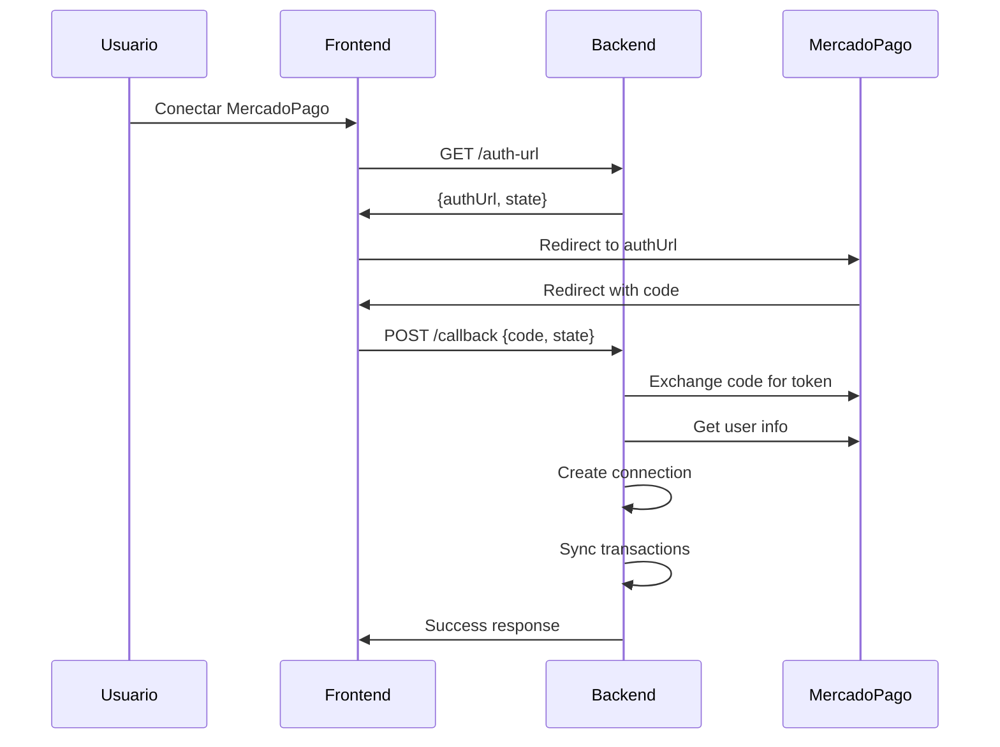
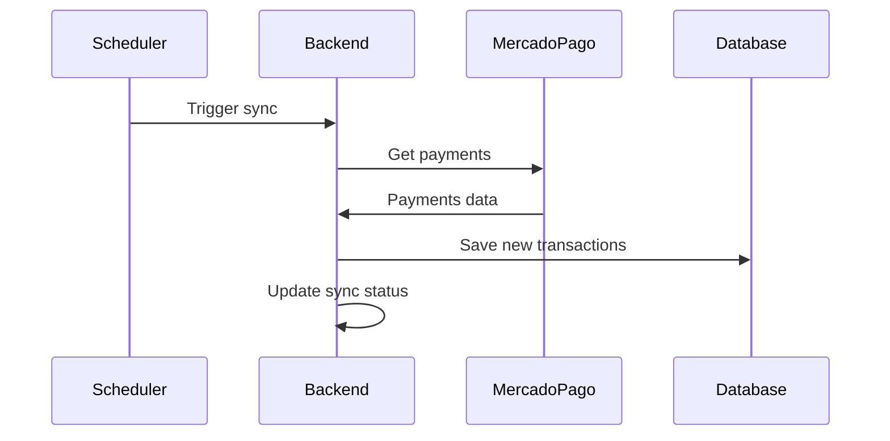

# 🚀 MercadoPago - Mejores Prácticas Implementadas

## 📋 Resumen de Implementación

Este documento describe las mejores prácticas actuales de MercadoPago implementadas en el proyecto, basadas en la documentación oficial más reciente.

## ✅ Mejores Prácticas Implementadas

### 1. **OAuth 2.0 Flow Seguro**

#### ✅ Parámetro `state` para CSRF Protection
```javascript
// Generar state aleatorio para prevenir ataques CSRF
const stateParam = state || crypto.randomBytes(32).toString('hex');
const authUrl = `https://auth.mercadopago.com/authorization?client_id=${clientId}&response_type=code&platform_id=mp&redirect_uri=${encodeURIComponent(redirectUri)}&state=${stateParam}`;
```

#### ✅ Validación de State en Callback
```javascript
// Validar el parámetro state para prevenir CSRF
if (req.session && req.session.mercadopagoState && state !== req.session.mercadopagoState) {
  return res.status(400).json({ message: 'Invalid state parameter' });
}
```

### 2. **Manejo Robusto de Errores**

#### ✅ Errores Específicos de MercadoPago
```javascript
if (response.status === 401) {
  throw new Error('Token de acceso expirado o inválido');
} else if (response.status === 403) {
  throw new Error('Acceso denegado - verificar permisos de la aplicación');
} else if (response.status === 429) {
  throw new Error('Rate limit excedido - intentar más tarde');
}
```

#### ✅ Logging Detallado
```javascript
console.error('Error response from MercadoPago:', {
  status: response.status,
  statusText: response.statusText,
  body: errorText,
  userId: this.userId
});
```

### 3. **Headers Recomendados**

#### ✅ User-Agent Header
```javascript
headers: { 
  'Authorization': `Bearer ${this.accessToken}`,
  'Content-Type': 'application/json',
  'User-Agent': 'PresentApp/1.0' // Identificar la aplicación
}
```

### 4. **Rate Limiting y Retry Logic**

#### ✅ Exponential Backoff
```javascript
// Exponential backoff: esperar 2^attempt * 1000ms
const delay = Math.min(1000 * Math.pow(2, attempt), 10000);
await new Promise(resolve => setTimeout(resolve, delay));
```

#### ✅ Timeout Protection
```javascript
return await Promise.race([
  operation(),
  new Promise((_, reject) => 
    setTimeout(() => reject(new Error('Timeout')), this.timeout)
  )
]);
```

### 5. **Parámetros de Consulta Optimizados**

#### ✅ Límites y Ordenamiento
```javascript
// Agregar límite para evitar respuestas muy grandes
params.append('limit', limit.toString());

// Ordenar por fecha de creación descendente
params.append('sort', 'date_created.desc');
```

### 6. **Seguridad de Credenciales**

#### ✅ Encriptación de Tokens
```javascript
// Encriptar credenciales sensibles antes de guardar
const credencialesEncriptadas = {};
for (const [key, value] of Object.entries(datosConexion.credenciales)) {
  if (value) {
    credencialesEncriptadas[key] = this.bankSyncService.encrypt(value);
  }
}
```

### 7. **Validaciones de Entrada**

#### ✅ Validación de Campos Requeridos
```javascript
if (datosConexion.tipo === 'MERCADOPAGO') {
  if (!datosConexion.credenciales?.userId) {
    return res.status(400).json({ message: 'User ID de MercadoPago requerido.' });
  }
  if (!datosConexion.nombre || datosConexion.nombre.trim() === '') {
    return res.status(400).json({ message: 'El nombre de la conexión MercadoPago no puede estar vacío.' });
  }
}
```

## 🔧 Configuración Requerida

### Variables de Entorno
```bash
MERCADOPAGO_CLIENT_ID=your_client_id
MERCADOPAGO_CLIENT_SECRET=your_client_secret
ENCRYPTION_KEY=your_32_character_encryption_key
```

### URLs de Callback Registradas
- **Desarrollo**: `http://localhost:3000/mercadopago/callback`
- **Staging**: `https://staging.present.attadia.com/mercadopago/callback`
- **Producción**: `https://admin.attadia.com/mercadopago/callback`

## 📊 Monitoreo y Logging

### Logs Estructurados
```javascript
logger.mercadopago('TOKEN_EXCHANGE_SUCCESS', 'Intercambio de token exitoso', {
  userId: data.user_id,
  tokenType: data.token_type,
  expiresIn: data.expires_in,
  scope: data.scope,
  duration
});
```

### Métricas de Performance
```javascript
logger.performance('mercadopago_token_exchange', duration, {
  userId: data.user_id,
  success: true
});
```

## 🚨 Manejo de Errores Comunes

### 1. **Token Expirado (401)**
- **Causa**: El access_token ha expirado
- **Solución**: Usar refresh_token para obtener nuevo access_token
- **Implementación**: Automático en el adapter

### 2. **Rate Limit Excedido (429)**
- **Causa**: Demasiadas peticiones en poco tiempo
- **Solución**: Implementar retry con exponential backoff
- **Implementación**: Automático en el adapter

### 3. **Permisos Insuficientes (403)**
- **Causa**: La aplicación no tiene los scopes necesarios
- **Solución**: Verificar configuración en MercadoPago Developers
- **Implementación**: Error descriptivo en logs

## 🔄 Flujo de Sincronización

### 1. **Conexión Inicial**


### 2. **Sincronización Periódica**


## 📈 Métricas Recomendadas

### 1. **Latencia de API**
- Tiempo de respuesta de `/users/me`
- Tiempo de respuesta de `/payments/search`
- Tiempo de intercambio de tokens

### 2. **Tasa de Éxito**
- Porcentaje de sincronizaciones exitosas
- Porcentaje de tokens válidos
- Tasa de errores por tipo

### 3. **Volumen de Datos**
- Número de transacciones sincronizadas
- Tamaño de respuestas de API
- Frecuencia de uso

## 🔮 Próximas Mejoras

### 1. **Webhooks (Futuro)**
- Implementar webhooks para sincronización en tiempo real
- Reducir latencia de sincronización
- Mejorar experiencia del usuario

### 2. **Cache Inteligente**
- Cachear respuestas de API por tiempo limitado
- Reducir llamadas a MercadoPago
- Mejorar performance

### 3. **Métricas Avanzadas**
- Dashboard de métricas de integración
- Alertas automáticas para errores
- Análisis de tendencias de uso

## 📚 Referencias

- [Documentación Oficial de MercadoPago](https://www.mercadopago.com.ar/developers)
- [Guía de OAuth 2.0](https://www.mercadopago.com.ar/developers/en/reference/oauth/_oauth_token/post)
- [API de Pagos](https://www.mercadopago.com.ar/developers/en/reference/payments/_payments_search/get)
- [API de Usuarios](https://www.mercadopago.com.ar/developers/en/reference/users/_users_me/get)

## 🤝 Contribución

Para mantener las mejores prácticas actualizadas:

1. Revisar documentación oficial mensualmente
2. Actualizar este documento con cambios
3. Probar nuevas funcionalidades en staging
4. Documentar cualquier cambio en la API 