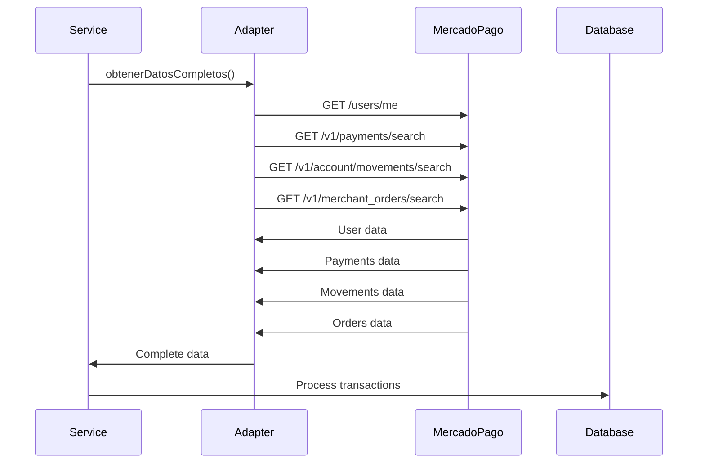

# 🚀 MercadoPago - Mejores Prácticas Implementadas (Actualizado)

## 🟢 Novedad: Integración Productiva Validada
- El flujo de pago productivo fue validado exitosamente usando la API REST de MercadoPago (no el SDK).
- Se recomienda usar la API REST para crear preferencias de pago en producción.
- Para pruebas productivas, usar cuentas distintas para comprador y vendedor.

## 📋 Resumen de Implementación

Este documento describe las mejores prácticas actuales de MercadoPago implementadas en el proyecto, basadas en la **nueva integración completa** que permite obtener todos los datos disponibles de la cuenta del usuario.

## ✅ Mejores Prácticas Implementadas

### 1. **OAuth 2.0 Flow Seguro**

#### ✅ Parámetro `state` para CSRF Protection
```javascript
// Generar state aleatorio para prevenir ataques CSRF
const stateParam = state || crypto.randomBytes(32).toString('hex');
const authUrl = `https://auth.mercadopago.com/authorization?client_id=${clientId}&response_type=code&platform_id=mp&redirect_uri=${encodeURIComponent(redirectUri)}&state=${stateParam}`;
```

#### ✅ Validación de State en Callback
```javascript
// Validar el parámetro state para prevenir CSRF
if (req.session && req.session.mercadopagoState && state !== req.session.mercadopagoState) {
  return res.status(400).json({ message: 'Parámetro state inválido' });
}
```

### 2. **Obtención Total de Datos**

#### ✅ Múltiples Endpoints de Datos
```javascript
// Nuevo servicio de datos completos
class MercadoPagoDataService {
  async obtenerDatosCompletos() {
    const [pagos, movimientosCuenta, ordenesComerciante] = await Promise.allSettled([
      this.mpAdapter.getMovimientos({ since: fechaDesdeISO, limit }),
      this.mpAdapter.getAccountMovements({ since: fechaDesdeISO, limit }),
      this.mpAdapter.getMerchantOrders({ since: fechaDesdeISO, limit })
    ]);
  }
}
```

#### ✅ Parámetros de Fecha Correctos
```javascript
// CORRECTO: Para /v1/payments/search
params.append('range', 'date_created');
params.append('begin_date', since);
params.append('end_date', endDate);

// CORRECTO: Para /v1/account/movements/search
params.append('date_created_from', since);
params.append('date_created_to', endDate);

// CORRECTO: Para /v1/merchant_orders/search
params.append('date_created_from', since);
params.append('date_created_to', endDate);
```

### 3. **Manejo Robusto de Errores**

#### ✅ Errores Específicos de MercadoPago
```javascript
if (response.status === 401) {
  throw new Error('Token de acceso expirado o inválido');
} else if (response.status === 403) {
  throw new Error('Acceso denegado - verificar permisos de la aplicación');
} else if (response.status === 429) {
  throw new Error('Rate limit excedido - intentar más tarde');
}
```

#### ✅ Manejo de Errores por Endpoint
```javascript
// Cada endpoint se maneja independientemente
const resultados = {
  pagos: pagos.status === 'fulfilled' ? pagos.value : [],
  movimientosCuenta: movimientosCuenta.status === 'fulfilled' ? movimientosCuenta.value : [],
  ordenesComerciante: ordenesComerciante.status === 'fulfilled' ? ordenesComerciante.value : [],
  errores: []
};
```

#### ✅ Logging Detallado
```javascript
console.error('Error response from MercadoPago payments:', {
  status: response.status,
  statusText: response.statusText,
  body: errorText,
  userId: this.userId,
  url
});
```

### 4. **Headers Recomendados**

#### ✅ User-Agent Header
```javascript
headers: { 
  'Authorization': `Bearer ${this.accessToken}`,
  'Content-Type': 'application/json',
  'User-Agent': 'PresentApp/1.0' // Identificar la aplicación
}
```

### 5. **Rate Limiting y Retry Logic**

#### ✅ Exponential Backoff
```javascript
// Exponential backoff: esperar 2^attempt * 1000ms
const delay = Math.min(1000 * Math.pow(2, attempt), 10000);
await new Promise(resolve => setTimeout(resolve, delay));
```

#### ✅ Timeout Protection
```javascript
return await Promise.race([
  operation(),
  new Promise((_, reject) => 
    setTimeout(() => reject(new Error('Timeout')), this.timeout)
  )
]);
```

### 6. **Parámetros de Consulta Optimizados**

#### ✅ Límites y Ordenamiento
```javascript
// Agregar límite para evitar respuestas muy grandes
params.append('limit', limit.toString());

// Ordenar por fecha de creación descendente
params.append('sort', 'date_created.desc');
```

### 7. **Gestión Inteligente de Monedas**

#### ✅ Detección Automática por País
```javascript
// Obtener país del usuario y asignar moneda correspondiente
const pais = userInfo.country_id || 'AR';
const moneda = await this.obtenerMonedaPorPais(pais);

// Crear moneda automáticamente si no existe
const moneda = await this.obtenerOCrearMoneda(pago.currency_id || 'ARS');
```

### 8. **Seguridad de Credenciales**

#### ✅ Encriptación de Tokens
```javascript
// Encriptar credenciales sensibles antes de guardar
const credencialesEncriptadas = {
  accessToken: this.encrypt(accessToken),
  refreshToken: this.encrypt(refreshToken),
  userId: this.encrypt(userId.toString())
};
```

### 9. **Categorización Automática**

#### ✅ Categorización Inteligente
```javascript
const categorizarTransaccion = (descripcion) => {
  const desc = descripcion.toLowerCase();
  
  if (desc.includes('comida') || desc.includes('restaurante')) {
    return 'Comida y Mercado';
  }
  if (desc.includes('transporte') || desc.includes('uber')) {
    return 'Transporte';
  }
  // ... más categorías
};
```

## 🔧 Configuración Requerida

### Variables de Entorno
```bash
MERCADOPAGO_CLIENT_ID=your_client_id
MERCADOPAGO_CLIENT_SECRET=your_client_secret
ENCRYPTION_KEY=your_32_character_encryption_key
FRONTEND_URL=https://tu-dominio.com
```

### URLs de Callback Registradas
- **Desarrollo**: `http://localhost:3000/mercadopago/callback`
- **Staging**: `https://staging.present.attadia.com/mercadopago/callback`
- **Producción**: `https://admin.attadia.com/mercadopago/callback`

## 📊 Monitoreo y Logging

### Logs Estructurados
```javascript
logger.mercadopago('DATA_OBTAINED', 'Datos completos obtenidos', {
  userId: this.usuarioId,
  totalPagos: resultados.pagos.length,
  totalMovimientos: resultados.movimientosCuenta.length,
  errores: resultados.errores.length
});
```

### Métricas de Performance
```javascript
logger.performance('mercadopago_data_complete', duration, {
  userId: this.usuarioId,
  totalEndpoints: 3,
  successRate: successRate
});
```

## 🚨 Manejo de Errores Comunes

### 1. **Error 400: "date_created.from is not a possible param"**
- **Causa**: Parámetros de fecha incorrectos para el endpoint
- **Solución**: Usar `range=date_created&begin_date=...&end_date=...` para `/v1/payments/search`
- **Implementación**: Corregido en el nuevo adaptador

### 2. **Token Expirado (401)**
- **Causa**: El access_token ha expirado
- **Solución**: Usar refresh_token para obtener nuevo access_token
- **Implementación**: Automático en el adapter

### 3. **Rate Limit Excedido (429)**
- **Causa**: Demasiadas peticiones en poco tiempo
- **Solución**: Implementar retry con exponential backoff
- **Implementación**: Automático en el adapter

### 4. **Permisos Insuficientes (403)**
- **Causa**: La aplicación no tiene los scopes necesarios
- **Solución**: Verificar configuración en MercadoPago Developers
- **Implementación**: Error descriptivo en logs

## 🔄 Flujo de Sincronización Completo

### 1. **Conexión Inicial**


### 2. **Obtención de Datos Completos**


## 📈 Métricas Recomendadas

### 1. **Latencia de API**
- Tiempo de respuesta de `/users/me`
- Tiempo de respuesta de `/v1/payments/search`
- Tiempo de respuesta de `/v1/account/movements/search`
- Tiempo de respuesta de `/v1/merchant_orders/search`
- Tiempo de intercambio de tokens

### 2. **Tasa de Éxito**
- Porcentaje de sincronizaciones exitosas
- Porcentaje de tokens válidos
- Tasa de errores por endpoint
- Tasa de errores por tipo

### 3. **Volumen de Datos**
- Número de transacciones sincronizadas
- Tamaño de respuestas de API
- Frecuencia de uso por endpoint
- Distribución de tipos de transacciones

## 🔮 Próximas Mejoras

### 1. **Webhooks (Futuro)**
- Implementar webhooks para sincronización en tiempo real
- Reducir latencia de sincronización
- Mejorar experiencia del usuario

### 2. **Cache Inteligente**
- Cachear respuestas de API por tiempo limitado
- Reducir llamadas a MercadoPago
- Mejorar performance

### 3. **Métricas Avanzadas**
- Dashboard de métricas de integración
- Alertas automáticas para errores
- Análisis de tendencias de uso

## 📚 Referencias

- [Documentación Oficial de MercadoPago](https://www.mercadopago.com.ar/developers)
- [Guía de OAuth 2.0](https://www.mercadopago.com.ar/developers/en/reference/oauth/_oauth_token/post)
- [API de Pagos](https://www.mercadopago.com.ar/developers/en/reference/payments/_payments_search/get)
- [API de Movimientos](https://www.mercadopago.com.ar/developers/en/reference/account/_account_movements_search/get)
- [API de Órdenes](https://www.mercadopago.com.ar/developers/en/reference/merchant_orders/_merchant_orders_search/get)
- [API de Usuarios](https://www.mercadopago.com.ar/developers/en/reference/users/_users_me/get)

## 🤝 Contribución

Para mantener las mejores prácticas actualizadas:

1. Revisar regularmente la documentación oficial de MercadoPago
2. Actualizar este documento cuando se implementen nuevas funcionalidades
3. Documentar cualquier cambio en los parámetros de la API
4. Mantener actualizada la lista de errores comunes y sus soluciones

---

**Nota**: Este documento ha sido actualizado para reflejar la nueva integración completa de Mercado Pago que incluye obtención de datos de múltiples endpoints y procesamiento robusto de transacciones. 