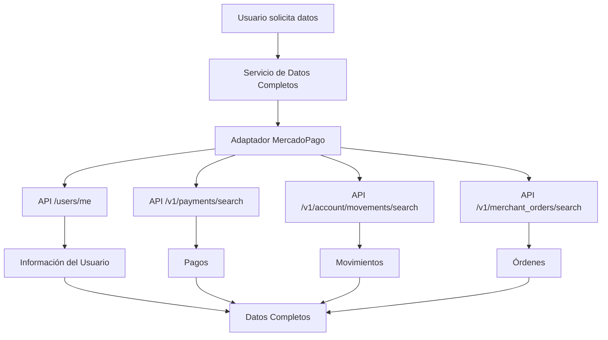
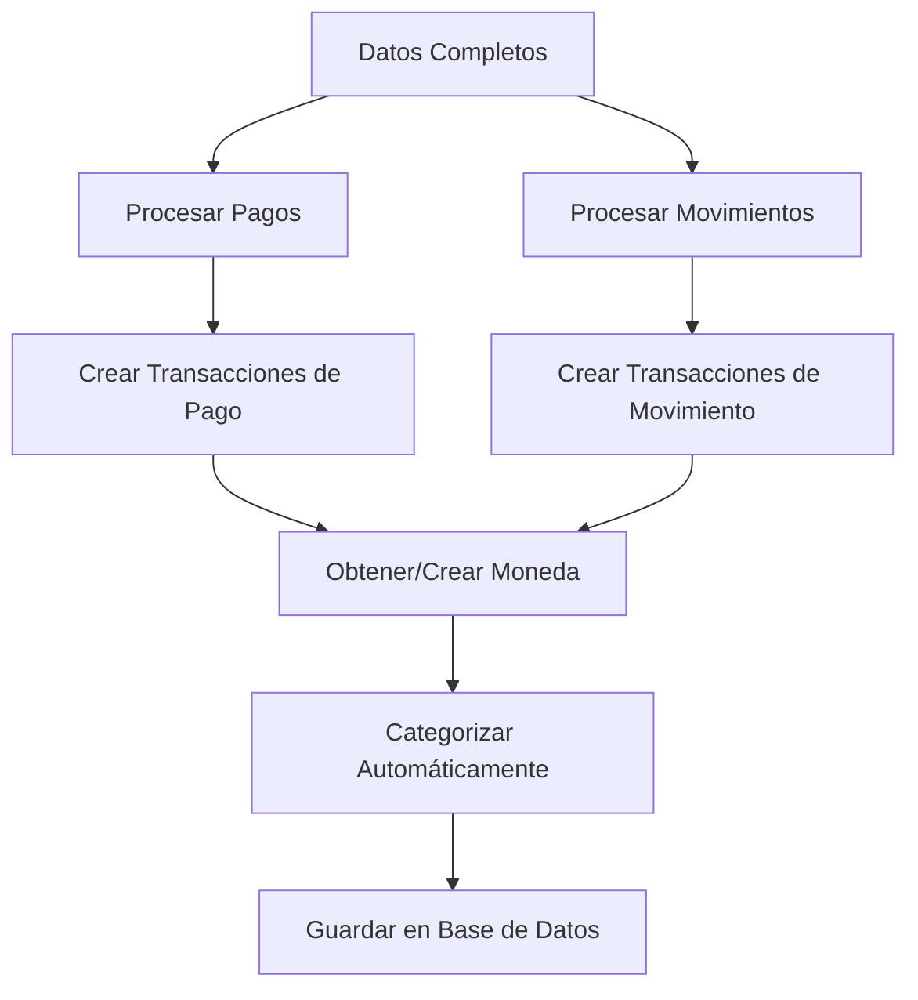

# Integración Completa de Mercado Pago

## Resumen

Esta documentación describe la integración completa y robusta con Mercado Pago que permite obtener y gestionar todos los datos disponibles de la cuenta del usuario, incluyendo pagos, movimientos de cuenta y órdenes de comerciante.

## Características Principales

### ✅ **Obtención Total de Datos**
- **Pagos**: Todos los pagos realizados y recibidos
- **Movimientos de Cuenta**: Transacciones internas de la cuenta
- **Órdenes de Comerciante**: Órdenes de compra/venta
- **Información de Usuario**: Datos del perfil de Mercado Pago

### ✅ **Gestión Inteligente de Monedas**
- Detección automática de monedas por país
- Creación automática de monedas ISO 4217
- Soporte multi-moneda completo

### ✅ **Procesamiento Robusto**
- Manejo de errores por endpoint
- Reintentos automáticos con backoff exponencial
- Validación de datos antes de guardar

### ✅ **Categorización Automática**
- Categorización inteligente basada en descripciones
- Soporte para múltiples categorías predefinidas
- Personalizable por usuario

## Arquitectura

### 1. **Adaptador de Mercado Pago** (`mercadoPagoAdapter.js`)
```javascript
// Maneja la comunicación directa con la API de Mercado Pago
class MercadoPagoAdapter {
  async getUserInfo()           // /users/me
  async getMovimientos()        // /v1/payments/search
  async getAccountMovements()   // /v1/account/movements/search
  async getMerchantOrders()     // /v1/merchant_orders/search
}
```

### 2. **Servicio de Datos Completos** (`mercadoPagoDataService.js`)
```javascript
// Procesa y gestiona todos los datos obtenidos
class MercadoPagoDataService {
  async obtenerDatosCompletos()     // Obtiene datos de todos los endpoints
  async procesarPagos()             // Convierte pagos en transacciones
  async procesarMovimientosCuenta() // Convierte movimientos en transacciones
  async crearTransaccionDePago()    // Crea transacciones desde pagos
  async crearTransaccionDeMovimiento() // Crea transacciones desde movimientos
}
```

### 3. **Servicio de Sincronización** (`bankSyncService.js`)
```javascript
// Coordina la sincronización completa
class BankSyncService {
  async sincronizarConMercadoPago() // Usa el servicio de datos completos
}
```

## Endpoints de la API

### **Obtener Datos Completos**
```http
GET /api/bankconnections/mercadopago/datos-completos/:conexionId
```

**Parámetros:**
- `fechaDesde` (opcional): Fecha desde la cual obtener datos
- `limit` (opcional): Límite de registros por endpoint (default: 100)

**Respuesta:**
```json
{
  "message": "Datos completos obtenidos exitosamente",
  "datos": {
    "usuario": { /* información del usuario */ },
    "pagos": [ /* array de pagos */ ],
    "movimientosCuenta": [ /* array de movimientos */ ],
    "ordenesComerciante": [ /* array de órdenes */ ],
    "errores": [ /* errores por endpoint */ ]
  },
  "resumen": {
    "totalPagos": 25,
    "totalMovimientos": 15,
    "totalOrdenes": 8,
    "errores": 0
  }
}
```

### **Procesar Datos**
```http
POST /api/bankconnections/mercadopago/procesar-datos/:conexionId
```

**Body:**
```json
{
  "procesarPagos": true,
  "procesarMovimientos": true
}
```

**Respuesta:**
```json
{
  "message": "Datos procesados exitosamente",
  "resultados": {
    "pagos": { "nuevas": 10, "actualizadas": 2 },
    "movimientos": { "nuevas": 5, "actualizadas": 1 },
    "errores": []
  },
  "resumen": {
    "totalNuevas": 15,
    "totalActualizadas": 3,
    "totalErrores": 0
  }
}
```

## Flujo de Datos

### 1. **Obtención de Datos**


### 2. **Procesamiento de Transacciones**


## Manejo de Errores

### **Errores por Endpoint**
- Cada endpoint se maneja independientemente
- Los errores se registran pero no detienen el proceso
- Se retorna información sobre qué endpoints fallaron

### **Reintentos Automáticos**
- Backoff exponencial (1s, 2s, 4s, 8s, 10s máximo)
- Máximo 3 reintentos por operación
- Timeout de 10 segundos por request

### **Errores Comunes**
```javascript
// Token expirado
if (response.status === 401) {
  throw new Error('Token de acceso expirado o inválido');
}

// Rate limit
if (response.status === 429) {
  throw new Error('Rate limit excedido - intentar más tarde');
}

// Acceso denegado
if (response.status === 403) {
  throw new Error('Acceso denegado - verificar permisos de la aplicación');
}
```

## Gestión de Monedas

### **Detección Automática**
```javascript
// Por país del usuario
const pais = userInfo.country_id || 'AR';
const moneda = await obtenerMonedaPorPais(pais);

// Por transacción individual
const moneda = await obtenerOCrearMoneda(pago.currency_id || 'ARS');
```

### **Monedas Soportadas**
- **ARS**: Peso Argentino
- **USD**: Dólar Estadounidense
- **BRL**: Real Brasileño
- **CLP**: Peso Chileno
- **COP**: Peso Colombiano
- **MXN**: Peso Mexicano
- **PEN**: Sol Peruano
- **UYU**: Peso Uruguayo
- **VES**: Bolívar Venezolano

## Categorización Automática

### **Categorías Soportadas**
- **Comida y Mercado**: restaurantes, supermercados
- **Transporte**: Uber, taxi, transporte público
- **Ropa**: vestimenta, zapatos
- **Tecnología**: computadoras, celulares
- **Salud y Belleza**: médicos, farmacias
- **Fiesta**: eventos, celebraciones
- **Otro**: categoría por defecto

### **Lógica de Categorización**
```javascript
const categorizarTransaccion = (descripcion) => {
  const desc = descripcion.toLowerCase();
  
  if (desc.includes('comida') || desc.includes('restaurante')) {
    return 'Comida y Mercado';
  }
  // ... más lógica
};
```

## Componente Frontend

### **MercadoPagoDataManager**
```jsx
<MercadoPagoDataManager 
  conexionId={conexionId}
  onDataProcessed={(resultados) => {
    // Callback cuando se procesan datos
  }}
/>
```

### **Características del Componente**
- **Vista de datos completos**: Muestra todos los datos obtenidos
- **Procesamiento selectivo**: Procesar solo pagos o solo movimientos
- **Tablas interactivas**: Datos organizados en acordeones
- **Estados visuales**: Chips de colores para estados
- **Alertas**: Notificaciones de éxito y error

## Configuración

### **Variables de Entorno**
```bash
MERCADOPAGO_CLIENT_ID=tu_client_id
MERCADOPAGO_CLIENT_SECRET=tu_client_secret
FRONTEND_URL=https://tu-dominio.com
```

### **Rate Limiting**
```javascript
// MercadoPago: 10 requests por minuto
const mercadopagoLimiter = rateLimit({
  windowMs: 60 * 1000,
  max: 10
});

// Sincronización: 5 requests por 5 minutos
const syncLimiter = rateLimit({
  windowMs: 5 * 60 * 1000,
  max: 5
});
```

## Monitoreo y Logs

### **Logs Estructurados**
```javascript
logger.mercadopago('DATA_OBTAINED', 'Datos completos obtenidos', {
  userId: this.usuarioId,
  totalPagos: resultados.pagos.length,
  totalMovimientos: resultados.movimientosCuenta.length,
  errores: resultados.errores.length
});
```

### **Métricas Importantes**
- Tiempo de respuesta por endpoint
- Tasa de éxito por tipo de operación
- Número de transacciones procesadas
- Errores por tipo y frecuencia

## Casos de Uso

### **1. Usuario Normal (Comprador)**
- Obtiene pagos realizados
- Ve movimientos de cuenta
- Transacciones categorizadas automáticamente

### **2. Vendedor**
- Obtiene pagos recibidos
- Ve órdenes de comerciante
- Gestión completa de ingresos

### **3. Usuario Mixto**
- Combina datos de compras y ventas
- Vista unificada de todas las transacciones
- Balance completo por moneda

## Mejoras Futuras

### **Funcionalidades Planificadas**
- [ ] Sincronización automática programada
- [ ] Webhooks para actualizaciones en tiempo real
- [ ] Análisis de patrones de gasto
- [ ] Exportación de datos a CSV/Excel
- [ ] Integración con otros proveedores de pago

### **Optimizaciones Técnicas**
- [ ] Cache de datos para reducir llamadas a la API
- [ ] Procesamiento en lotes para grandes volúmenes
- [ ] Compresión de datos históricos
- [ ] Dashboard de métricas en tiempo real

## Troubleshooting

### **Problemas Comunes**

#### **Error 400: "date_created.from is not a possible param"**
**Causa**: Parámetros de fecha incorrectos para el endpoint
**Solución**: Usar `range=date_created&begin_date=...&end_date=...` para `/v1/payments/search`

#### **Error 401: Token expirado**
**Causa**: Access token ha expirado
**Solución**: Renovar token usando refresh token

#### **Error 429: Rate limit excedido**
**Causa**: Demasiadas llamadas a la API
**Solución**: Implementar rate limiting y reintentos

#### **Error 403: Acceso denegado**
**Causa**: Permisos insuficientes en la aplicación
**Solución**: Verificar configuración de la app en Mercado Pago

### **Comandos de Diagnóstico**
```bash
# Verificar logs de Mercado Pago
grep "MercadoPago" /var/log/app.log

# Verificar estado de conexiones
curl -X GET "https://api.admin.attadia.com/api/bankconnections" \
  -H "Authorization: Bearer $TOKEN"

# Probar endpoint de datos completos
curl -X GET "https://api.admin.attadia.com/api/bankconnections/mercadopago/datos-completos/$CONNECTION_ID" \
  -H "Authorization: Bearer $TOKEN"
```

## Conclusión

Esta integración completa de Mercado Pago proporciona:

1. **Obtención total de datos** de todos los endpoints disponibles
2. **Procesamiento robusto** con manejo de errores avanzado
3. **Gestión inteligente de monedas** con soporte multi-moneda
4. **Categorización automática** para mejor organización
5. **Interfaz de usuario completa** para gestión y visualización
6. **Monitoreo y logs** para debugging y análisis

La solución es escalable, mantenible y proporciona una experiencia de usuario excepcional para la gestión financiera personal y empresarial. 