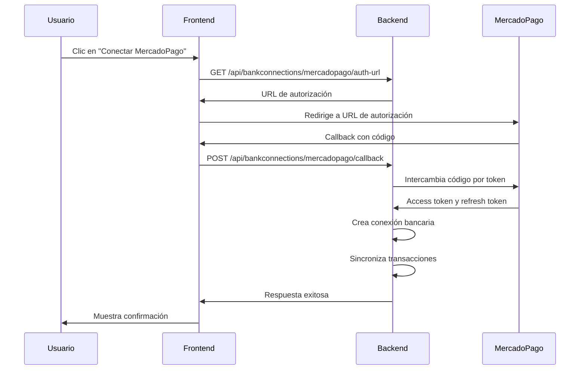
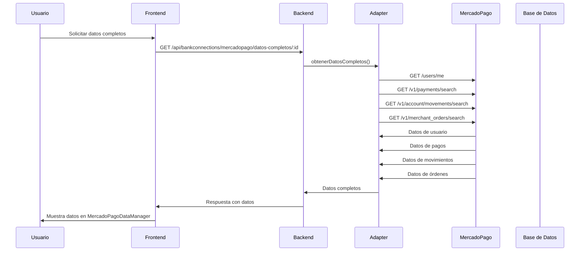
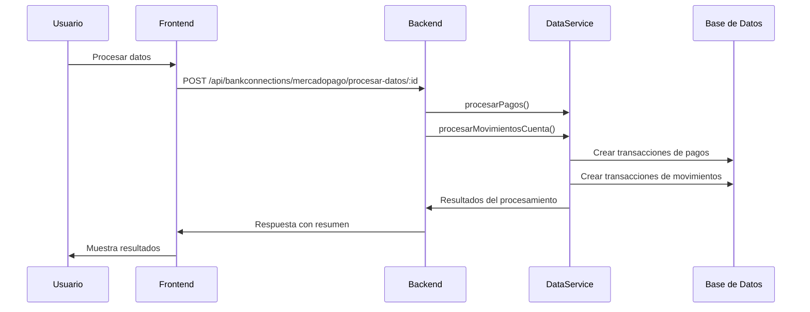
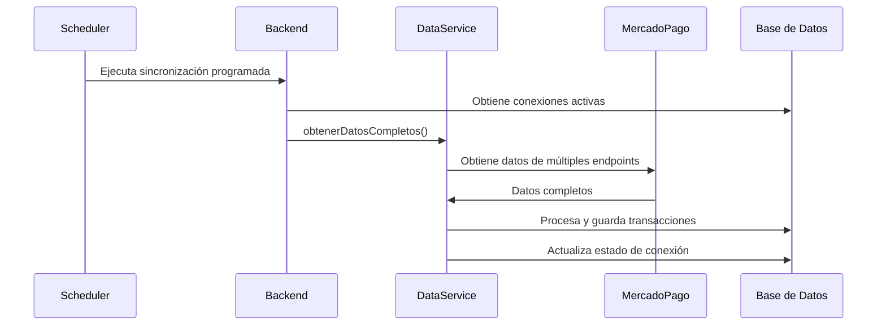

# Integración Modular de MercadoPago (Actualizada)

## Descripción General

Esta es la versión modular y mejorada de la integración con MercadoPago, diseñada para ser más mantenible, escalable y fácil de usar. **Ahora incluye obtención total de datos** de todos los endpoints disponibles de Mercado Pago.

## Arquitectura Modular

### Frontend

#### 1. Servicio (`frontend/src/services/mercadopagoService.js`)
- **Responsabilidad**: Maneja todas las comunicaciones con el backend
- **Métodos**:
  - `getAuthUrl()`: Obtiene URL de autorización OAuth
  - `processCallback(code)`: Procesa el callback OAuth
  - `connect()`: Inicia el flujo de conexión
  - `syncConnection(connectionId)`: Sincroniza manualmente
  - `verifyConnection(connectionId)`: Verifica el estado de la conexión

#### 2. Hook Personalizado (`frontend/src/hooks/useMercadoPago.js`)
- **Responsabilidad**: Maneja el estado y la lógica de UI
- **Estados**:
  - `loading`: Estado de carga general
  - `connecting`: Estado específico de conexión OAuth
- **Métodos**: Wrappers de los métodos del servicio con manejo de errores

#### 3. Configuración (`frontend/src/config/mercadopago.js`)
- **Responsabilidad**: Configuración centralizada
- **Contenido**:
  - URLs de redirección por ambiente
  - Colores de marca
  - Configuración de sincronización
  - Mapeo de estados y tipos de pago

#### 4. Componentes
- **`MercadoPagoConnectButton`**: Botón de conexión OAuth
- **`DigitalWalletConnectButton`**: Componente genérico para billeteras
- **`MercadoPagoCallbackPage`**: Página de procesamiento del callback
- **`MercadoPagoDataManager`**: **NUEVO** - Gestión completa de datos

### Backend

#### 1. OAuth Service (`backend/src/oauth/mercadoPagoOAuth.js`)
- **Responsabilidad**: Maneja el flujo OAuth con MercadoPago
- **Métodos**:
  - `getAuthUrl(redirectUri)`: Genera URL de autorización
  - `exchangeCodeForToken({ code, redirectUri })`: Intercambia código por token
  - `refreshAccessToken({ refreshToken })`: Refresca tokens expirados

#### 2. Bank Connection Controller (`backend/src/controllers/bankConnectionController.js`)
- **Responsabilidad**: Endpoints para conexiones bancarias
- **Endpoints**:
  - `GET /api/bankconnections/mercadopago/auth-url`: URL de autorización
  - `POST /api/bankconnections/mercadopago/callback`: Procesa callback OAuth
  - `POST /api/bankconnections/:id/sync`: Sincronización manual
  - `POST /api/bankconnections/:id/verificar`: Verificación de conexión
  - **`GET /api/bankconnections/mercadopago/datos-completos/:conexionId`**: **NUEVO** - Obtiene datos completos
  - **`POST /api/bankconnections/mercadopago/procesar-datos/:conexionId`**: **NUEVO** - Procesa datos completos

#### 3. Bank Sync Service (`backend/src/services/bankSyncService.js`)
- **Responsabilidad**: Sincronización de transacciones
- **Métodos**:
  - `sincronizarConMercadoPago(bankConnection)`: Sincronización específica
  - `obtenerPagosMercadoPago(mercadopago, fechaDesde)`: Obtiene pagos
  - `formatearDescripcionMercadoPago(pago)`: Formatea descripciones
  - `mapearEstadoMercadoPago(status)`: Mapea estados

#### 4. **NUEVO: MercadoPago Adapter** (`backend/src/services/adapters/mercadoPagoAdapter.js`)
- **Responsabilidad**: Comunicación directa con la API de Mercado Pago
- **Métodos**:
  - `getUserInfo()`: Obtiene información del usuario
  - `getMovimientos()`: Obtiene pagos (con parámetros corregidos)
  - `getAccountMovements()`: Obtiene movimientos de cuenta
  - `getMerchantOrders()`: Obtiene órdenes de comerciante

#### 5. **NUEVO: MercadoPago Data Service** (`backend/src/services/mercadoPagoDataService.js`)
- **Responsabilidad**: Procesamiento completo de datos de Mercado Pago
- **Métodos**:
  - `obtenerDatosCompletos()`: Obtiene datos de todos los endpoints
  - `procesarPagos()`: Convierte pagos en transacciones
  - `procesarMovimientosCuenta()`: Convierte movimientos en transacciones
  - `crearTransaccionDePago()`: Crea transacciones desde pagos
  - `crearTransaccionDeMovimiento()`: Crea transacciones desde movimientos

## Flujo de Integración

### 1. Conexión OAuth


### 2. **NUEVO: Obtención de Datos Completos**


### 3. **NUEVO: Procesamiento de Datos**


### 4. Sincronización Automática


## Configuración

### Variables de Entorno

#### Backend
```bash
# MercadoPago OAuth
MERCADOPAGO_CLIENT_ID=tu_client_id
MERCADOPAGO_CLIENT_SECRET=tu_client_secret

# Encriptación
ENCRYPTION_KEY=tu_clave_de_encriptacion_secreta

# Frontend URL
FRONTEND_URL=https://tu-dominio.com

# Timezone para scheduler
TZ=America/Santiago
```

#### Frontend
```javascript
// Configuración automática según ambiente
const config = {
  development: {
    redirectURI: 'http://localhost:5173/mercadopago/callback'
  },
  staging: {
    redirectURI: 'https://staging.present.attadia.com/mercadopago/callback'
  },
  production: {
    redirectURI: 'https://present.attadia.com/mercadopago/callback'
  }
};
```

### Configuración en MercadoPago Developers

1. Crear aplicación en [MercadoPago Developers](https://www.mercadopago.com.ar/developers)
2. Configurar URLs de redirección:
   - Desarrollo: `http://localhost:5173/mercadopago/callback`
   - Staging: `https://staging.present.attadia.com/mercadopago/callback`
   - Producción: `https://present.attadia.com/mercadopago/callback`

## Uso

### 1. Conectar MercadoPago
```javascript
import { useMercadoPago } from '../hooks/useMercadoPago';

const { connect, connecting } = useMercadoPago();

const handleConnect = async () => {
  try {
    await connect();
  } catch (error) {
    console.error('Error conectando:', error);
  }
};
```

### 2. **NUEVO: Obtener Datos Completos**
```javascript
import MercadoPagoDataManager from '../components/bankconnections/MercadoPagoDataManager';

<MercadoPagoDataManager 
  conexionId={conexionId}
  onDataProcessed={(resultados) => {
    console.log('Datos procesados:', resultados);
  }}
/>
```

### 3. **NUEVO: Procesar Datos Selectivamente**
```javascript
// Procesar solo pagos
const procesarSoloPagos = async () => {
  const response = await api.post(`/api/bankconnections/mercadopago/procesar-datos/${conexionId}`, {
    procesarPagos: true,
    procesarMovimientos: false
  });
};

// Procesar solo movimientos
const procesarSoloMovimientos = async () => {
  const response = await api.post(`/api/bankconnections/mercadopago/procesar-datos/${conexionId}`, {
    procesarPagos: false,
    procesarMovimientos: true
  });
};
```

### 4. Sincronizar Manualmente
```javascript
import { useMercadoPago } from '../hooks/useMercadoPago';

const { syncConnection, loading } = useMercadoPago();

const handleSync = async (connectionId) => {
  try {
    const result = await syncConnection(connectionId);
    console.log('Sincronización completada:', result);
  } catch (error) {
    console.error('Error sincronizando:', error);
  }
};
```

### 5. Verificar Conexión
```javascript
import { useMercadoPago } from '../hooks/useMercadoPago';

const { verifyConnection, loading } = useMercadoPago();

const handleVerify = async (connectionId) => {
  try {
    const result = await verifyConnection(connectionId);
    console.log('Conexión verificada:', result);
  } catch (error) {
    console.error('Error verificando:', error);
  }
};
```

## Características

### ✅ Implementado
- [x] Flujo OAuth completo
- [x] **Obtención total de datos** (pagos, movimientos, órdenes)
- [x] **Procesamiento selectivo** de datos
- [x] **Componente de gestión de datos** completo
- [x] Sincronización automática
- [x] Categorización automática de transacciones
- [x] Manejo de errores robusto
- [x] Encriptación de credenciales
- [x] Refresh automático de tokens
- [x] Historial de sincronizaciones
- [x] Configuración por ambiente
- [x] Componentes modulares y reutilizables
- [x] **Gestión inteligente de monedas**
- [x] **Parámetros de fecha corregidos**

### 🔄 En Desarrollo
- [ ] Webhooks para sincronización en tiempo real
- [ ] Notificaciones push
- [ ] Dashboard de estadísticas
- [ ] Filtros avanzados
- [ ] Reconcilación automática

### 📋 Próximamente
- [ ] Integración con otras billeteras digitales
- [ ] Análisis de patrones de gastos
- [ ] Reportes personalizados
- [ ] Exportación de datos
- [ ] Backup automático

## **NUEVO: Endpoints de Datos Completos**

### Obtener Datos Completos
```http
GET /api/bankconnections/mercadopago/datos-completos/:conexionId
```

**Parámetros:**
- `fechaDesde` (opcional): Fecha desde la cual obtener datos
- `limit` (opcional): Límite de registros por endpoint (default: 100)

**Respuesta:**
```json
{
  "message": "Datos completos obtenidos exitosamente",
  "datos": {
    "usuario": { /* información del usuario */ },
    "pagos": [ /* array de pagos */ ],
    "movimientosCuenta": [ /* array de movimientos */ ],
    "ordenesComerciante": [ /* array de órdenes */ ],
    "errores": [ /* errores por endpoint */ ]
  },
  "resumen": {
    "totalPagos": 25,
    "totalMovimientos": 15,
    "totalOrdenes": 8,
    "errores": 0
  }
}
```

### Procesar Datos
```http
POST /api/bankconnections/mercadopago/procesar-datos/:conexionId
```

**Body:**
```json
{
  "procesarPagos": true,
  "procesarMovimientos": true
}
```

**Respuesta:**
```json
{
  "message": "Datos procesados exitosamente",
  "resultados": {
    "pagos": { "nuevas": 10, "actualizadas": 2 },
    "movimientos": { "nuevas": 5, "actualizadas": 1 },
    "errores": []
  },
  "resumen": {
    "totalNuevas": 15,
    "totalActualizadas": 3,
    "totalErrores": 0
  }
}
```

## Troubleshooting

### Problemas Comunes

#### 1. **Error 400: "date_created.from is not a possible param"**
```bash
# SOLUCIONADO: Usar parámetros correctos
# Para /v1/payments/search:
range=date_created&begin_date=2024-01-01T00:00:00Z&end_date=2024-12-31T23:59:59Z

# Para /v1/account/movements/search:
date_created_from=2024-01-01T00:00:00Z&date_created_to=2024-12-31T23:59:59Z
```

#### 2. Error de configuración OAuth
```bash
# Verificar variables de entorno
echo $MERCADOPAGO_CLIENT_ID
echo $MERCADOPAGO_CLIENT_SECRET

# Verificar configuración en MercadoPago
# - URLs de redirección correctas
# - Aplicación activa
# - Permisos configurados
```

#### 3. Error de sincronización
```bash
# Verificar logs del backend
docker logs -f backend | grep "MercadoPago"

# Verificar estado de conexión
curl -H "Authorization: Bearer TOKEN" \
  http://localhost:8080/api/bankconnections
```

#### 4. **NUEVO: Error de obtención de datos completos**
```bash
# Verificar logs específicos
docker logs -f backend | grep "MercadoPagoDataService"

# Probar endpoint directamente
curl -H "Authorization: Bearer TOKEN" \
  "http://localhost:8080/api/bankconnections/mercadopago/datos-completos/CONNECTION_ID"
```

## **NUEVO: Componente MercadoPagoDataManager**

### Características
- **Vista de datos completos**: Muestra todos los datos obtenidos
- **Procesamiento selectivo**: Procesar solo pagos o solo movimientos
- **Tablas interactivas**: Datos organizados en acordeones
- **Estados visuales**: Chips de colores para estados
- **Alertas**: Notificaciones de éxito y error

### Uso
```jsx
import MercadoPagoDataManager from '../components/bankconnections/MercadoPagoDataManager';

function BankConnectionDetail({ conexionId }) {
  return (
    <div>
      <h2>Gestión de Datos Mercado Pago</h2>
      <MercadoPagoDataManager 
        conexionId={conexionId}
        onDataProcessed={(resultados) => {
          console.log('Datos procesados:', resultados);
          // Actualizar UI o mostrar notificación
        }}
      />
    </div>
  );
}
```

---

**Nota**: Esta documentación ha sido actualizada para reflejar la nueva integración completa de Mercado Pago que incluye obtención de datos de múltiples endpoints, procesamiento robusto y un componente de gestión de datos completo. 