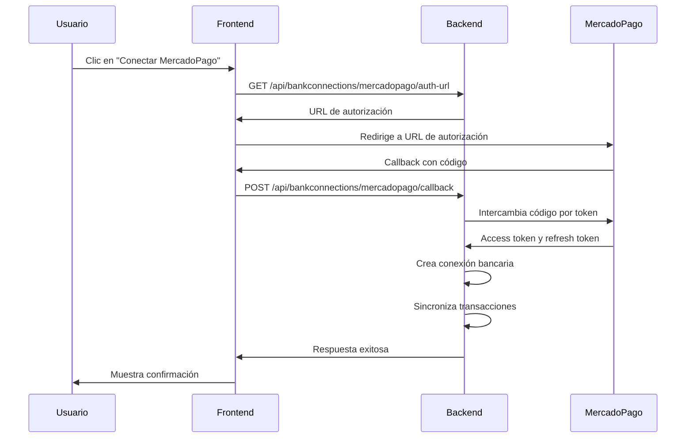
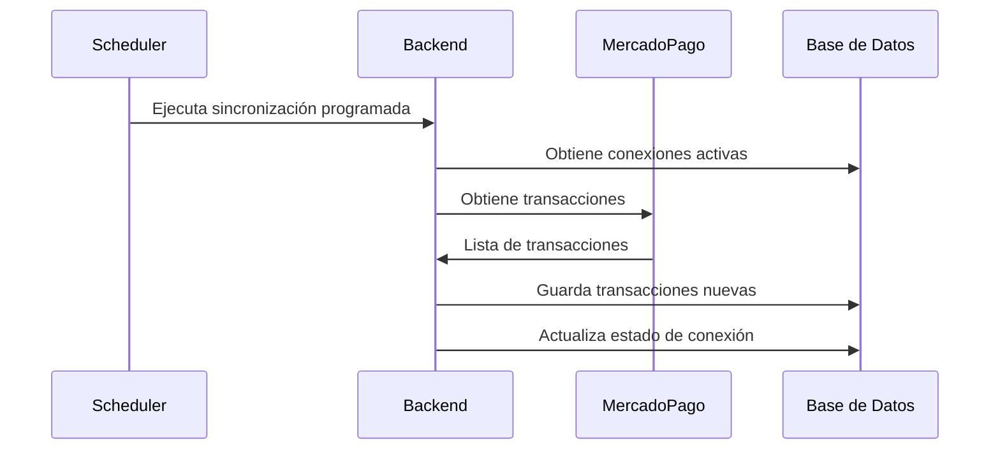

# Integración Modular de MercadoPago

## Descripción General

Esta es la versión modular y mejorada de la integración con MercadoPago, diseñada para ser más mantenible, escalable y fácil de usar.

## Arquitectura Modular

### Frontend

#### 1. Servicio (`frontend/src/services/mercadopagoService.js`)
- **Responsabilidad**: Maneja todas las comunicaciones con el backend
- **Métodos**:
  - `getAuthUrl()`: Obtiene URL de autorización OAuth
  - `processCallback(code)`: Procesa el callback OAuth
  - `connect()`: Inicia el flujo de conexión
  - `syncConnection(connectionId)`: Sincroniza manualmente
  - `verifyConnection(connectionId)`: Verifica el estado de la conexión

#### 2. Hook Personalizado (`frontend/src/hooks/useMercadoPago.js`)
- **Responsabilidad**: Maneja el estado y la lógica de UI
- **Estados**:
  - `loading`: Estado de carga general
  - `connecting`: Estado específico de conexión OAuth
- **Métodos**: Wrappers de los métodos del servicio con manejo de errores

#### 3. Configuración (`frontend/src/config/mercadopago.js`)
- **Responsabilidad**: Configuración centralizada
- **Contenido**:
  - URLs de redirección por ambiente
  - Colores de marca
  - Configuración de sincronización
  - Mapeo de estados y tipos de pago

#### 4. Componentes
- **`MercadoPagoConnectButton`**: Botón de conexión OAuth
- **`DigitalWalletConnectButton`**: Componente genérico para billeteras
- **`MercadoPagoCallbackPage`**: Página de procesamiento del callback

### Backend

#### 1. OAuth Service (`backend/src/oauth/mercadoPagoOAuth.js`)
- **Responsabilidad**: Maneja el flujo OAuth con MercadoPago
- **Métodos**:
  - `getAuthUrl(redirectUri)`: Genera URL de autorización
  - `exchangeCodeForToken({ code, redirectUri })`: Intercambia código por token
  - `refreshAccessToken({ refreshToken })`: Refresca tokens expirados

#### 2. Bank Connection Controller (`backend/src/controllers/bankConnectionController.js`)
- **Responsabilidad**: Endpoints para conexiones bancarias
- **Endpoints**:
  - `GET /api/bankconnections/mercadopago/auth-url`: URL de autorización
  - `POST /api/bankconnections/mercadopago/callback`: Procesa callback OAuth
  - `POST /api/bankconnections/:id/sync`: Sincronización manual
  - `POST /api/bankconnections/:id/verificar`: Verificación de conexión

#### 3. Bank Sync Service (`backend/src/services/bankSyncService.js`)
- **Responsabilidad**: Sincronización de transacciones
- **Métodos**:
  - `sincronizarConMercadoPago(bankConnection)`: Sincronización específica
  - `obtenerPagosMercadoPago(mercadopago, fechaDesde)`: Obtiene pagos
  - `formatearDescripcionMercadoPago(pago)`: Formatea descripciones
  - `mapearEstadoMercadoPago(status)`: Mapea estados

## Flujo de Integración

### 1. Conexión OAuth


### 2. Sincronización Automática


## Configuración

### Variables de Entorno

#### Backend
```bash
# MercadoPago OAuth
MERCADOPAGO_CLIENT_ID=tu_client_id
MERCADOPAGO_CLIENT_SECRET=tu_client_secret

# Encriptación
ENCRYPTION_KEY=tu_clave_de_encriptacion_secreta

# Timezone para scheduler
TZ=America/Santiago
```

#### Frontend
```javascript
// Configuración automática según ambiente
const config = {
  development: {
    redirectURI: 'http://localhost:5173/mercadopago/callback'
  },
  staging: {
    redirectURI: 'https://staging.present.attadia.com/mercadopago/callback'
  },
  production: {
    redirectURI: 'https://present.attadia.com/mercadopago/callback'
  }
};
```

### Configuración en MercadoPago Developers

1. Crear aplicación en [MercadoPago Developers](https://www.mercadopago.com.ar/developers)
2. Configurar URLs de redirección:
   - Desarrollo: `http://localhost:5173/mercadopago/callback`
   - Staging: `https://staging.present.attadia.com/mercadopago/callback`
   - Producción: `https://present.attadia.com/mercadopago/callback`

## Uso

### 1. Conectar MercadoPago
```javascript
import { useMercadoPago } from '../hooks/useMercadoPago';

const { connect, connecting } = useMercadoPago();

const handleConnect = async () => {
  try {
    await connect();
  } catch (error) {
    console.error('Error conectando:', error);
  }
};
```

### 2. Sincronizar Manualmente
```javascript
import { useMercadoPago } from '../hooks/useMercadoPago';

const { syncConnection, loading } = useMercadoPago();

const handleSync = async (connectionId) => {
  try {
    const result = await syncConnection(connectionId);
    console.log('Sincronización completada:', result);
  } catch (error) {
    console.error('Error sincronizando:', error);
  }
};
```

### 3. Verificar Conexión
```javascript
import { useMercadoPago } from '../hooks/useMercadoPago';

const { verifyConnection, loading } = useMercadoPago();

const handleVerify = async (connectionId) => {
  try {
    const result = await verifyConnection(connectionId);
    console.log('Conexión verificada:', result);
  } catch (error) {
    console.error('Error verificando:', error);
  }
};
```

## Características

### ✅ Implementado
- [x] Flujo OAuth completo
- [x] Sincronización automática
- [x] Categorización automática de transacciones
- [x] Manejo de errores robusto
- [x] Encriptación de credenciales
- [x] Refresh automático de tokens
- [x] Historial de sincronizaciones
- [x] Configuración por ambiente
- [x] Componentes modulares y reutilizables

### 🔄 En Desarrollo
- [ ] Webhooks para sincronización en tiempo real
- [ ] Notificaciones push
- [ ] Dashboard de estadísticas
- [ ] Filtros avanzados
- [ ] Reconcilación automática

### 📋 Próximamente
- [ ] Integración con otras billeteras digitales
- [ ] Análisis de patrones de gastos
- [ ] Reportes personalizados
- [ ] Exportación de datos
- [ ] Backup automático

## Troubleshooting

### Problemas Comunes

#### 1. Error de configuración OAuth
```bash
# Verificar variables de entorno
echo $MERCADOPAGO_CLIENT_ID
echo $MERCADOPAGO_CLIENT_SECRET

# Verificar configuración en MercadoPago
# - URLs de redirección correctas
# - Aplicación activa
# - Permisos configurados
```

#### 2. Error de sincronización
```bash
# Verificar logs del backend
docker logs -f backend | grep "MercadoPago"

# Verificar estado de conexión
curl -H "Authorization: Bearer TOKEN" \
  http://localhost:8080/api/bankconnections
```

#### 3. Error de encriptación
```bash
# Verificar clave de encriptación
echo $ENCRYPTION_KEY

# La clave debe ser de al menos 32 caracteres
```

### Logs Útiles

#### Frontend
```javascript
// Habilitar logs detallados
localStorage.setItem('debug', 'mercadopago:*');

// Ver logs en consola del navegador
console.log('MercadoPago Service:', mercadopagoService);
```

#### Backend
```bash
# Logs de OAuth
grep "OAuth" logs/app.log

# Logs de sincronización
grep "sincronización" logs/app.log

# Logs de errores
grep "ERROR" logs/app.log | grep "MercadoPago"
```

## Pruebas

### Script de Prueba
```bash
# Ejecutar script de prueba
cd backend
node test-mercadopago-flow.js
```

### Pruebas Manuales
1. **Conexión OAuth**:
   - Clic en "Conectar MercadoPago"
   - Autorizar en MercadoPago
   - Verificar que se crea la conexión

2. **Sincronización**:
   - Crear transacción en MercadoPago
   - Ejecutar sincronización manual
   - Verificar que aparece en la app

3. **Categorización**:
   - Verificar que las transacciones se categorizan automáticamente
   - Revisar las reglas de categorización

## Seguridad

### Encriptación
- Credenciales encriptadas con AES-256-CBC
- Clave de encriptación en variables de entorno
- Solo se desencriptan durante la sincronización

### Validación
- Validación de tokens OAuth
- Verificación de permisos de usuario
- Sanitización de datos de entrada

### Auditoría
- Logs de todas las operaciones
- Historial de sincronizaciones
- Trazabilidad completa

## Soporte

Para problemas técnicos:

1. Revisar logs del sistema
2. Verificar configuración de variables de entorno
3. Probar con el script de prueba
4. Consultar documentación de MercadoPago Developers
5. Contactar al equipo de desarrollo con logs y detalles

---

**Nota**: Esta integración está diseñada para uso personal y de pequeñas empresas. Para uso comercial a gran escala, considera implementar medidas adicionales de seguridad y monitoreo. 